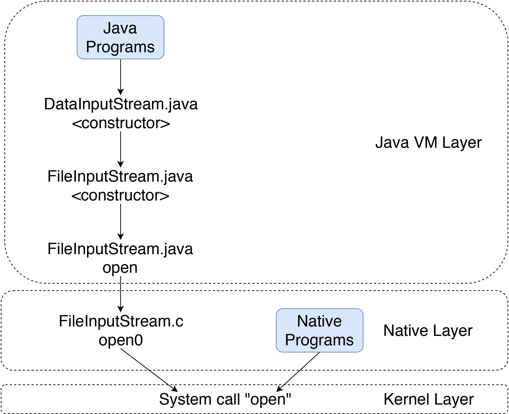
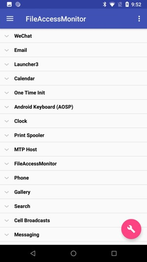
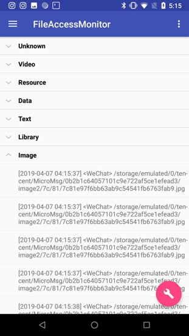

# Android File Access Monitor

This Android application helps you monitor all files accesses in your Android phone. This program only works with a custom kernel. The patch is located at [Github Gist](https://gist.github.com/Yjlcoder/9fd78d7b3f78776233205397ca03c99f).

Read the full paper [here](docs/paper.pdf)

# How files are accessed in Android system

# Interface

## By app

## By file type

